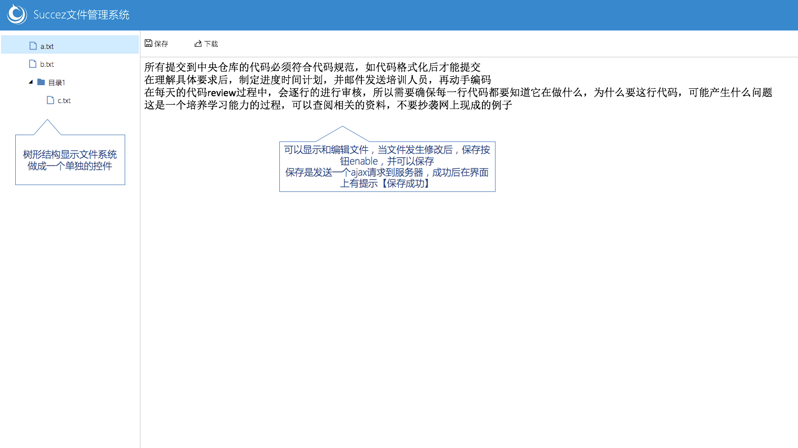

# study-filesystem

文件管理系统学习项目。

## 培训目标

1. 初步掌握JAVA/JS/CSS/HTML语言
2. 掌握面向接口编程，前后端分离的开发方式
3. 学会在浏览器开发者工具中调试JS代码
4. 学会输出调试日志
5. 初步掌握程序结构设计(对象设计)的技巧
6. 初步养成编写高性能代码的习惯

## 产品目标

实现一个文件管理系统，能够对磁盘上的文件进行树形浏览和修改：

1. 访问localhost:8080/project，显示当前eclipse的项目的classpath根目录
2. 支持修改文本文件内容
3. 支持下载文件
4. 支持用树形控件显示文件目录结构

### UI设计

## 时间安排

见[项目甘特图](study-filesystem甘特图.xlsx)

##  后端方向

### 技术目标1 - web容器

实现一个简易的web容器，能够处理文件管理系统的请求和响应，参考servlet规范中的request和response接口的设计。

1. 掌握web容器的相关知识，了解如tomcat的原理、作用和实现机制
2. 熟悉HTTP相关知识，理解HTTP头部，实现对get和post请求的解析
3. 理解servlet API的设计，并能够应用到web容器的接口设计中
4. 掌握多线程技术
5. 掌握IO相关技术
6. 掌握socket相关技术
7. 使用slf4j输出日志，不能使用system.out

## 技术目标2 - ftp文件管理系统

基于简易web容器，实现一个ftp文件下载系统。

1. 熟悉针对接口编程，ftp文件下载系统和web容器之间通过接口通信
2. 熟悉html、css和ts的编写，能够编写标准的布局和样式规范以及清晰的ts代码
3. 熟悉前后端通信过程，掌握ajax技术
4. 不使用任何第三方工具或者控件，包括jquery

## 前端方向

### 技术目标1 - HTTP服务器

使用node.js搭建一个简单的http服务器，能响应不同的url的请求。

1. 安装node环境，使用node.js搭建HTTP服务器。
2. 理解HTTP服务器的工作原理，了解服务器端路由和客户端路由的概念。
3. 理解HTTP相关知识，理解HTTP头部，实现对get/post请求的解析。

### 技术目标2 - 文件管理系统

基于简易web容器，实现一个文件管理系统。

1. 熟悉针对接口编程，ftp文件下载系统和web容器之间通过接口通信
2. 熟悉html、css和ts的编写，能够编写标准的布局和样式规范以及清晰的ts代码
3. 熟悉前后端通信过程，掌握ajax技术
4. 不使用任何第三方工具或者控件，包括jquery
